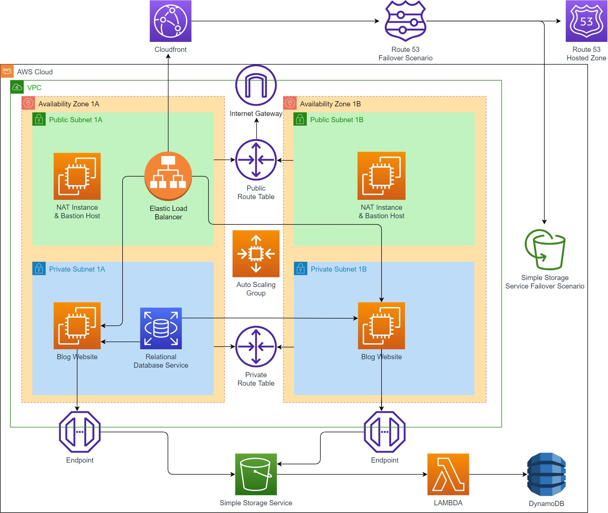

# Blog-Page-App--Django--on-AWS-Environment
Setting up the entire infrastructure and deploying the application on AWS involves a series of steps and numerous AWS CLI commands. Below, I will provide you with a high-level outline of each step along with the AWS CLI commands you can use to perform these tasks.

 

- Step 1: Create dedicated VPC and whole components
# Create the VPC
aws ec2 create-vpc --cidr-block 10.0.0.0/16

# Create two Availability Zones (AZs)
aws ec2 create-subnet --vpc-id <VPC_ID> --cidr-block 10.0.0.0/24 --availability-zone <AZ1>
aws ec2 create-subnet --vpc-id <VPC_ID> --cidr-block 10.0.1.0/24 --availability-zone <AZ2>

# Create an Internet Gateway
aws ec2 create-internet-gateway

# Attach the Internet Gateway to your VPC
aws ec2 attach-internet-gateway --vpc-id <VPC_ID>

# Create a NAT Gateway (for one public subnet)
aws ec2 create-nat-gateway --subnet-id <Public_Subnet_ID> --allocation-id <EIP_Allocation_ID>

# Create public and private route tables
aws ec2 create-route-table --vpc-id <VPC_ID>
aws ec2 create-route-table --vpc-id <VPC_ID>

# Create a route to the Internet Gateway for the public route table
aws ec2 create-route --route-table-id <Public_Route_Table_ID> --destination-cidr-block 0.0.0.0/0 --gateway-id <Internet_Gateway_ID>

# Associate public and private subnets with the route tables
aws ec2 associate-route-table --subnet-id <Public_Subnet_ID> --route-table-id <Public_Route_Table_ID>
aws ec2 associate-route-table --subnet-id <Private_Subnet_ID> --route-table-id <Private_Route_Table_ID>

-Step2:Create Security Groups (ALB ---> EC2 ---> RDS)

# Create security groups with appropriate inbound rules
aws ec2 create-security-group --group-name ALBSecurityGroup --description "ALB Security Group" --vpc-id <VPC_ID>
aws ec2 create-security-group --group-name EC2SecurityGroup --description "EC2 Security Group" --vpc-id <VPC_ID>
aws ec2 create-security-group --group-name RDSSecurityGroup --description "RDS Security Group" --vpc-id <VPC_ID>

# Configure security group inbound rules (e.g., allow HTTP/HTTPS)
aws ec2 authorize-security-group-ingress --group-id <ALB_Security_Group_ID> --protocol tcp --port 80 --source 0.0.0.0/0
aws ec2 authorize-security-group-ingress --group-id <ALB_Security_Group_ID> --protocol tcp --port 443 --source 0.0.0.0/0

# Repeat the above commands for EC2 and RDS security groups with appropriate rules.

-Step 3: Create RDS

# Create an RDS instance
aws rds create-db-instance --db-instance-identifier <DB_Instance_Name> --db-instance-class db.t2.micro --engine mysql --engine-version 8.0.20 --allocated-storage 20 --vpc-security-group-ids <RDSSecurityGroupID> --availability-zone <AZ>

-Step4 : Create two S3 Buckets and set one of these as static website

# Create the first S3 bucket for regular use
aws s3api create-bucket --bucket <Bucket1Name> --region <YourRegion>

# Create the second S3 bucket for the static website
aws s3api create-bucket --bucket <Bucket2Name> --region <YourRegion>

# Configure the second bucket for static website hosting
aws s3 website s3://<Bucket2Name> --index-document index.html --error-document error.html

# Optionally, you can upload your static website content to the second bucket
aws s3 cp <local_static_website_directory> s3://<Bucket2Name> --recursive

